<!-- ============================  HEADER  ============================ -->
<p align="center">
  
</p>

<p align="center">
  <a href="https://oshada.me/">
    
  </a>
</p>

<p align="center">
  <a href="https://oshada.me/"></a>
  <a href="mailto:oshadanethminamunasingha@gmail.com"></a>
  <a href="https://www.linkedin.com/in/oshada-nethmina/"></a>
</p>

<p align="center">
  
  
  
</p>

---

## 👨‍💻 About Me



I'm **Oshada**, a full-stack developer with a strong focus on **backend systems** — clean architecture, secure APIs and real-time features. I'm an undergraduate Software Engineering student who enjoys turning messy real-world problems into reliable, well-structured software.

- 🔭 Building production-style systems with **Spring Boot, .NET, NestJS & Next.js**
- 🌱 Learning **Cyber Security, Machine Learning & DevOps**
- 🤝 Open to collaborate on **open-source, full-stack & mobile apps**
- 💬 Ask me about **REST APIs, auth (JWT/RBAC), WebSockets, databases**
- ⚡ Fun fact: I code with music and run on coffee ☕

<br clear="right" />

```ts
const oshada = {
  role:      "Full-Stack Developer (Backend-focused)",
  backend:   ["Spring Boot", "NestJS", "ASP.NET Core", "Express", "Django"],
  frontend:  ["React", "Next.js", "Tailwind CSS", "MUI"],
  mobile:    ["React Native", "Flutter"],
  databases: ["PostgreSQL", "MySQL", "MongoDB", "SQL Server"],
  exploring: ["Cyber Security", "AI/ML", "DevOps"],
  motto:     "Make it work, make it right, make it fast.",
};
```

---

## 🛠️ Tech Stack

<table align="center">
  <tr>
    <td align="center" width="140"><b>Languages</b></td>
    <td></td>
  </tr>
  <tr>
    <td align="center"><b>Backend</b></td>
    <td></td>
  </tr>
  <tr>
    <td align="center"><b>Frontend &amp; Mobile</b></td>
    <td></td>
  </tr>
  <tr>
    <td align="center"><b>Databases &amp; ORM</b></td>
    <td></td>
  </tr>
  <tr>
    <td align="center"><b>DevOps &amp; Tools</b></td>
    <td></td>
  </tr>
  <tr>
    <td align="center"><b>Exploring</b></td>
    <td></td>
  </tr>
</table>

---

## 🚀 Featured Projects

<table>
  <tr>
    <td width="50%" valign="top">
      <h3>⛽ MyTurn — Smart Fuel Queue</h3>
      <p>Fuel-queue optimization system with live queue updates and secure onboarding.</p>
      <p><b>Highlights:</b> JWT auth, OTP email verification &amp; password reset, real-time updates over WebSocket/STOMP.</p>
      <p>
        
        
        
      </p>
      <a href="https://github.com/Oshada-Nethmina/REPO-NAME">View repo →</a>
    </td>
    <td width="50%" valign="top">
      <h3>🚚 Supply Chain Visibility Platform</h3>
      <p>Clean Architecture backend for tracking suppliers, warehouses and shipments.</p>
      <p><b>Highlights:</b> CQRS with MediatR, SignalR real-time updates, role-based access (Admin, Supplier, Warehouse Manager, Viewer).</p>
      <p>
        
        
        
      </p>
      <a href="https://github.com/Oshada-Nethmina/REPO-NAME">View repo →</a>
    </td>
  </tr>
  <tr>
    <td width="50%" valign="top">
      <h3>💼 SmartBiz</h3>
      <p>Business management web app with separate portals for business owners and admins.</p>
      <p><b>Highlights:</b> dual user-type authentication, layered Spring Boot API, MUI dashboard.</p>
      <p>
        
        
        
      </p>
      <a href="https://github.com/Oshada-Nethmina/REPO-NAME">View repo →</a>
    </td>
    <td width="50%" valign="top">
      <h3>📊 TeamPulse</h3>
      <p>Weekly report generator that turns team updates into clean, shareable reports.</p>
      <p><b>Highlights:</b> full-stack Next.js + Spring Boot architecture on PostgreSQL.</p>
      <p>
        
        
        
      </p>
      <a href="https://github.com/Oshada-Nethmina/REPO-NAME">View repo →</a>
    </td>
  </tr>
</table>

---

## 🎯 Current Focus

<p align="center">
  
</p>

---

## 🔥 GitHub Streak

<p align="center">
  
</p>

---

## 🛣️ Developer Journey

| Year | Milestone |
|:---:|---|
| **2022** | 🚀 Started learning programming |
| **2023** | 💻 Built my first full-stack applications |
| **2024** | 📱 Learned React Native & deep-dived into backend development |
| **2025** | 🔐 Started exploring Cyber Security & AI/ML |
| **2026** | 🏗️ Clean Architecture backends with Spring Boot, NestJS & .NET · final-year research |

---

## 🤝 Connect With Me

<p align="center">
  <b>Let's build something great together.</b><br/><br/>
  <a href="https://oshada.me/"></a>
  <a href="mailto:oshadanethminamunasingha@gmail.com"></a>
  <a href="https://www.linkedin.com/in/YOUR-LINKEDIN/"></a>
  <a href="https://github.com/Oshada-Nethmina?tab=repositories"></a>
</p>

<p align="center">
  
</p>
